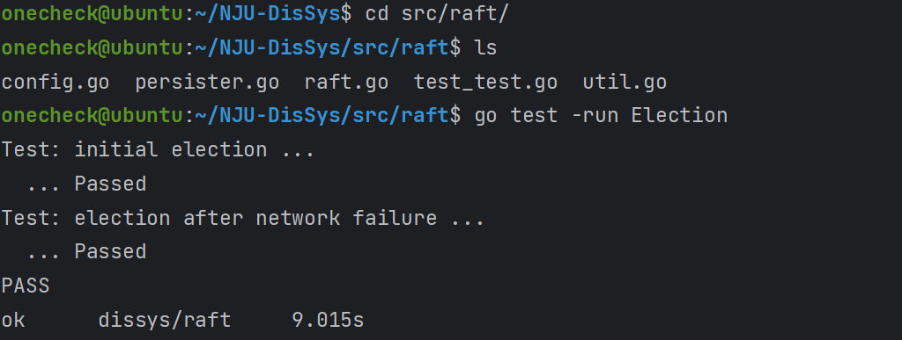
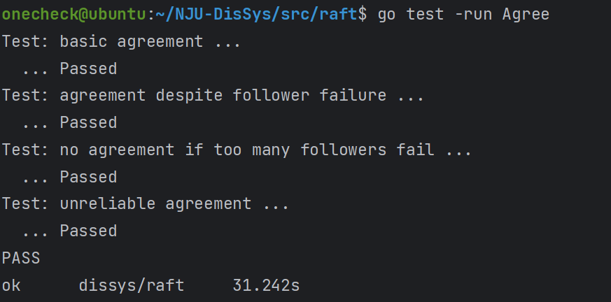
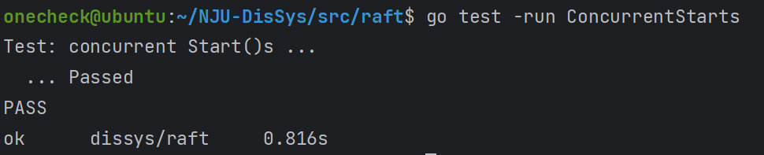
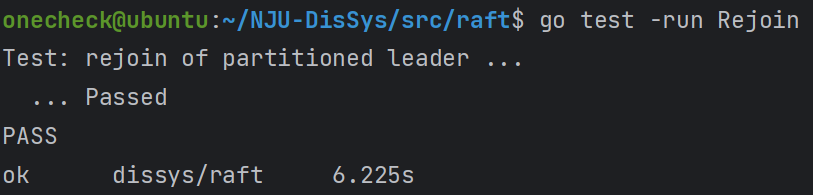
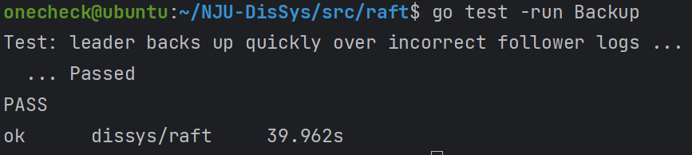
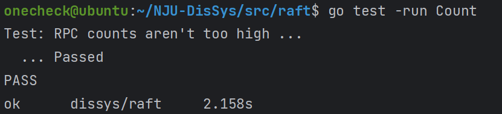

<b>实验报告</b>

# 1.问题分析

# 2.系统设计与实现

# 3. 实验演示

## Part 1
- Election

`TestInitialElection`、`TestReElection`测试结果

## Part 2
- Agree

`TestBasicAgree`、`TestFailAgree`、`TestFailNoAgree`、`TestUnreliableAgree`测试结果

- ConcurrentStarts

`TestConcurrentStarts`测试结果

- Rejoin

`TestRejoin`测试结果

- Backup

`TestBackup`测试结果

- Count

`TestCount`测试结果

# 4.总结
